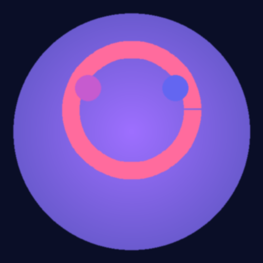

# 🎨 ImageAI - Générateur DALL-E 3 PWA

Une Progressive Web App (PWA) moderne et élégante pour générer des images avec l'IA DALL-E 3 d'OpenAI.



## ✨ Fonctionnalités

- 🎨 **Génération d'images IA** - Créez des images uniques avec DALL-E 3
- 📱 **Application mobile** - Interface native, installable sur mobile et desktop
- 📚 **Historique complet** - Sauvegarde de toutes vos créations
- 💾 **Téléchargement** - Téléchargez vos images en haute qualité
- 🔄 **3 formats** - Carré, paysage, portrait (1024x1024, 1792x1024, 1024x1792)
- 🔒 **Sécurisé** - Clé API stockée localement uniquement
- 🌐 **Mode hors ligne** - Interface accessible même sans connexion
- ⚡ **Rapide et fluide** - Design optimisé pour mobile

## 🚀 Installation

### Option 1 : Installation locale

1. **Téléchargez tous les fichiers** dans un dossier

2. **Démarrez un serveur local** :
   ```bash
   # Avec Python 3
   python -m http.server 8000
   
   # Ou avec Node.js (npx)
   npx serve
   
   # Ou avec PHP
   php -S localhost:8000
   ```

3. **Ouvrez votre navigateur** à `http://localhost:8000`

### Option 2 : Hébergement web

1. Uploadez tous les fichiers sur votre hébergeur web
2. Accédez à votre domaine
3. L'application proposera automatiquement l'installation

## 🔑 Configuration

### Obtenir une clé API OpenAI

1. Créez un compte sur [platform.openai.com](https://platform.openai.com)
2. Ajoutez un moyen de paiement (ou utilisez les crédits gratuits)
3. Allez dans [API Keys](https://platform.openai.com/api-keys)
4. Créez une nouvelle clé API (commence par `sk-proj-...` ou `sk-...`)

### Configurer l'application

1. Ouvrez l'application
2. Allez dans **Paramètres** (icône engrenage en bas)
3. Collez votre clé API
4. Cliquez sur **Enregistrer**
5. Testez la clé avec le bouton **Tester**

## 📱 Installation sur mobile

### iOS (iPhone/iPad)

1. Ouvrez l'app dans **Safari**
2. Appuyez sur le bouton **Partager** (carré avec flèche)
3. Sélectionnez **Sur l'écran d'accueil**
4. Confirmez

### Android

1. Ouvrez l'app dans **Chrome**
2. Appuyez sur le menu (3 points)
3. Sélectionnez **Installer l'application**
4. Confirmez

### Desktop (Chrome, Edge)

1. Cliquez sur l'icône **Installer** dans la barre d'adresse
2. Ou allez dans le menu → **Installer ImageAI**

## 💰 Coûts

L'utilisation de DALL-E 3 via l'API OpenAI est payante :

- **Standard 1024×1024** : ~$0.040 par image
- **HD 1024×1024** : ~$0.080 par image (non disponible dans cette version)
- **Paysage/Portrait** : ~$0.040 par image

Les nouveaux comptes reçoivent généralement **$5 à $18 de crédits gratuits**.

## 📂 Structure des fichiers

```
imageai/
├── index.html          # Structure HTML
├── styles.css          # Styles et design
├── app.js              # Logique JavaScript
├── sw.js               # Service Worker (PWA)
├── manifest.json       # Configuration PWA
├── icon.svg            # Logo SVG
├── icon-192.png        # Icône 192x192
├── icon-512.png        # Icône 512x512
└── README.md           # Ce fichier
```

## 🛠️ Technologies utilisées

- **HTML5** - Structure
- **CSS3** - Design moderne avec animations
- **JavaScript (Vanilla)** - Logique applicative
- **Service Worker** - Support hors ligne
- **LocalStorage** - Sauvegarde locale
- **OpenAI API** - DALL-E 3
- **PWA** - Installation et mode app

## 🎨 Design

- **Police display** : Playfair Display (titres)
- **Police body** : Outfit (texte)
- **Thème** : Sombre avec accents gradient (rose, violet, bleu)
- **Mobile-first** : Optimisé pour mobile puis desktop
- **Animations** : Transitions fluides et micro-interactions

## 🔒 Sécurité & Confidentialité

- ✅ Clé API stockée **uniquement** dans votre navigateur
- ✅ Historique stocké **localement** sur votre appareil
- ✅ Aucune donnée envoyée à des serveurs tiers
- ✅ Communication directe avec l'API OpenAI
- ✅ Pas de tracking, pas d'analytics

## 🐛 Dépannage

### L'app ne génère pas d'images

1. Vérifiez votre clé API dans les paramètres
2. Testez la clé avec le bouton "Tester"
3. Vérifiez vos crédits OpenAI sur [platform.openai.com](https://platform.openai.com/usage)
4. Vérifiez votre connexion internet

### L'app ne s'installe pas

1. Utilisez Chrome, Edge, ou Safari
2. Accédez à l'app en HTTPS (ou localhost)
3. Videz le cache et rechargez

### Les images ne se téléchargent pas

1. Vérifiez les autorisations de téléchargement
2. Essayez un autre navigateur
3. Vérifiez l'espace de stockage disponible

## 📝 Notes importantes

- **Quota API** : OpenAI limite le nombre de requêtes par minute
- **Taille des images** : Les URLs DALL-E 3 expirent après un certain temps
- **Stockage local** : Limité par le navigateur (~5-10MB généralement)
- **Hors ligne** : Seule l'interface fonctionne hors ligne, pas la génération

## 🔄 Mises à jour

Pour mettre à jour l'application :

1. Remplacez les fichiers par les nouvelles versions
2. Videz le cache du navigateur
3. Le Service Worker se mettra à jour automatiquement

## ⚠️ Limitations

- Nécessite une connexion internet pour générer
- Nécessite une clé API OpenAI valide
- Coût par image généré
- Stockage limité (navigateur)
- Les images DALL-E sont temporaires (URLs expirantes)

## 📄 Licence

Ce projet est sous licence MIT. Libre d'utilisation, modification et distribution.

## 🤝 Support

Pour toute question ou problème :

1. Vérifiez ce README
2. Consultez la [documentation OpenAI](https://platform.openai.com/docs)
3. Vérifiez votre clé API et vos crédits

## 🎯 Roadmap (fonctionnalités futures possibles)

- [ ] Support GPT-4 Vision pour l'édition d'images
- [ ] Export en différents formats
- [ ] Collections et dossiers
- [ ] Partage d'images
- [ ] Templates de prompts
- [ ] Mode sombre/clair personnalisable
- [ ] Support multi-langue

---

**Développé avec ❤️ pour les créatifs**

*ImageAI v1.0.0*


3️⃣ Alternatives GRATUITES à DALL-E 3
En attendant d'avoir des fonds :
Bing Image Creator (Microsoft) :

✅ Utilise DALL-E 3 aussi
✅ 100% GRATUIT (limité par jour)
✅ Pas de carte bancaire
🔗 bing.com/create

Leonardo.ai :

✅ 150 crédits/jour GRATUITS
✅ Très bonne qualité
🔗 leonardo.ai

Ideogram :

✅ Générations gratuites quotidiennes
🔗 ideogram.ai

Playground AI :

✅ 500 images/jour gratuites
🔗 playgroundai.com